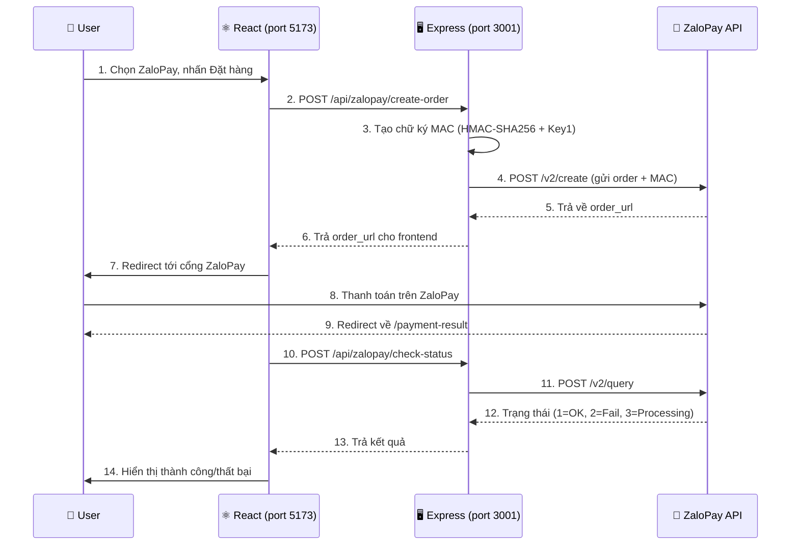

# 📘 Hướng dẫn từng bước: Xây dựng ZaloPay Payment Server

## Mục lục
1. [Tổng quan kiến trúc](#1-tổng-quan-kiến-trúc)
2. [Bước 1: Cài đặt thư viện](#bước-1-cài-đặt-thư-viện)
3. [Bước 2: Tạo file cấu hình ZaloPay](#bước-2-tạo-file-cấu-hình-zalopay)
4. [Bước 3: Tạo Express Server](#bước-3-tạo-express-server)
5. [Bước 4: Tạo Frontend Service](#bước-4-tạo-frontend-service)
6. [Bước 5: Cập nhật trang Checkout](#bước-5-cập-nhật-trang-checkout)
7. [Bước 6: Tạo trang Payment Result](#bước-6-tạo-trang-payment-result)
8. [Bước 7: Thêm Route và CSS](#bước-7-thêm-route-và-css)
9. [Cách chạy và test](#cách-chạy-và-test)

---

## 1. Tổng quan kiến trúc

### Tại sao cần Backend Server?

ZaloPay **bắt buộc** phải có backend vì:
- **Key1/Key2** là secret keys → không được để ở frontend (ai cũng xem được)
- **Chữ ký MAC** (HMAC-SHA256) phải tạo ở server bằng Key1
- **Callback** (thông báo thanh toán) là server-to-server, browser không nhận được
- **CORS** — ZaloPay API chặn gọi trực tiếp từ browser

### Flow thanh toán



### Cấu trúc file

```
my-react-app/
├── server/                          ← BACKEND (mới tạo)
│   ├── zalopay.config.cjs           ← Bước 2: Cấu hình credentials
│   └── index.cjs                    ← Bước 3: Express server (3 API)
│
├── src/
│   ├── firebase/
│   │   └── zalopayService.js        ← Bước 4: Frontend gọi backend
│   ├── pages/
│   │   ├── Checkout.jsx             ← Bước 5: Thêm option ZaloPay
│   │   └── PaymentResult.jsx        ← Bước 6: Trang kết quả
│   ├── styles/
│   │   └── cart.css                 ← Bước 7: Thêm CSS ZaloPay
│   └── App.jsx                      ← Bước 7: Thêm route
└── package.json                     ← Bước 1: Thêm dependencies
```

---

## Bước 1: Cài đặt thư viện

Chạy lệnh sau trong thư mục project:

```bash
npm install express cors axios crypto-js
```

| Thư viện | Vai trò |
|----------|---------|
| `express` | Tạo HTTP server, định nghĩa API routes |
| `cors` | Cho phép React (port 5173) gọi API server (port 3001) |
| `axios` | Gửi HTTP request từ server tới ZaloPay API |
| `crypto-js` | Tạo chữ ký HMAC-SHA256 (yêu cầu bảo mật của ZaloPay) |

> [!NOTE]
> Vì `package.json` có `"type": "module"`, các file server dùng đuôi `.cjs` để dùng cú pháp `require()` (CommonJS) thay vì `import` (ESM).

---

## Bước 2: Tạo file cấu hình ZaloPay

📄 **File:** [server/zalopay.config.cjs](file:///d:/Class/CSI09/React/my-react-app/server/zalopay.config.cjs)

Mục đích: Tập trung thông tin xác thực ZaloPay vào 1 file duy nhất.

```javascript
const zalopayConfig = {
    // App ID — ZaloPay cung cấp khi đăng ký merchant
    app_id: "2553",

    // Key1 — Dùng để TẠO chữ ký (MAC) khi GỬI request đi
    key1: "PcY4iZIKFCIdgZvA6ueMcMHHUbRLYjPL",

    // Key2 — Dùng để XÁC MINH chữ ký khi NHẬN callback về
    key2: "kLtgPl8YESDmyABkQgeZByOUJsbcpNI2",

    // Các URL API của ZaloPay (Sandbox = môi trường test)
    endpoint: {
        create: "https://sb-openapi.zalopay.vn/v2/create",   // Tạo đơn
        query: "https://sb-openapi.zalopay.vn/v2/query",      // Kiểm tra trạng thái
    },
};

module.exports = zalopayConfig;
```

### Giải thích 3 credentials:

| Credential | Khi nào dùng | Ví dụ tương tự |
|-----------|-------------|----------------|
| `app_id` | Mỗi request → xác định "ai đang gọi" | Như số CMND |
| `key1` | Khi **gửi** request → ký chữ ký | Như chữ ký tay khi gửi thư |
| `key2` | Khi **nhận** callback → xác minh đúng ZaloPay gửi | Như dấu bưu điện xác nhận |

> [!WARNING]
> Đây là credentials **Sandbox** (test). Khi deploy production, thay bằng credentials từ [mc.zalopay.vn](https://mc.zalopay.vn) và đổi URL từ `sb-openapi` thành `openapi`.

---

## Bước 3: Tạo Express Server

📄 **File:** [server/index.cjs](file:///d:/Class/CSI09/React/my-react-app/server/index.cjs)

### 3.1 — Khởi tạo Express + Middleware

```javascript
const express = require("express");
const cors = require("cors");
const axios = require("axios");
const CryptoJS = require("crypto-js");
const zalopayConfig = require("./zalopay.config.cjs");

const app = express();
const PORT = 3001;

// Middleware
app.use(cors());                              // Cho phép frontend gọi
app.use(express.json());                      // Parse JSON body
app.use(express.urlencoded({ extended: true })); // Parse form data
```

### 3.2 — API 1: Tạo đơn hàng (`POST /api/zalopay/create-order`)

Đây là API **quan trọng nhất**. Frontend gọi khi user nhấn "Thanh toán ZaloPay".

```javascript
app.post("/api/zalopay/create-order", async (req, res) => {
    const { amount, description, items, userId, orderId } = req.body;

    // ═══ BƯỚC 3.2.1: Tạo mã giao dịch duy nhất ═══
    // Format bắt buộc: yymmdd_xxxxx
    const now = new Date();
    const yy = String(now.getFullYear()).slice(-2);  // "26"
    const mm = String(now.getMonth() + 1).padStart(2, "0"); // "07"
    const dd = String(now.getDate()).padStart(2, "0"); // "08"
    const app_trans_id = `${yy}${mm}${dd}_${orderId}`;
    // Kết quả: "260708_ORD-ABC123"

    // ═══ BƯỚC 3.2.2: Chuẩn bị dữ liệu đơn hàng ═══
    const embed_data = JSON.stringify({
        redirecturl: "http://localhost:5173/payment-result",
    });

    const order = {
        app_id: parseInt(zalopayConfig.app_id),  // 2553
        app_trans_id: app_trans_id,               // "260708_ORD-ABC123"
        app_user: userId,                         // Firebase UID
        app_time: Date.now(),                     // Milliseconds
        amount: parseInt(amount),                 // VND (số nguyên)
        item: JSON.stringify(items || []),         // JSON string
        description: description,                 // Hiển thị trên ZaloPay
        embed_data: embed_data,                   // URL redirect về
        bank_code: "",                            // "" = hiện tất cả
    };

    // ═══ BƯỚC 3.2.3: Tạo chữ ký MAC (QUAN TRỌNG NHẤT) ═══
    // Nối các field theo THỨ TỰ CHÍNH XÁC bằng dấu "|"
    const data = zalopayConfig.app_id + "|"
               + order.app_trans_id + "|"
               + order.app_user + "|"
               + order.amount + "|"
               + order.app_time + "|"
               + order.embed_data + "|"
               + order.item;

    // Mã hoá bằng HMAC-SHA256 với Key1
    order.mac = CryptoJS.HmacSHA256(data, zalopayConfig.key1).toString();

    // ═══ BƯỚC 3.2.4: Gửi request tới ZaloPay ═══
    const response = await axios.post(
        zalopayConfig.endpoint.create,  // https://sb-openapi.zalopay.vn/v2/create
        null,
        { params: order }
    );

    // ═══ BƯỚC 3.2.5: Trả kết quả cho frontend ═══
    res.json({
        ...response.data,          // { return_code, order_url, zp_trans_token }
        app_trans_id: order.app_trans_id,  // Thêm mã giao dịch để track
    });
});
```

> [!IMPORTANT]
> **Chữ ký MAC là phần quan trọng nhất!**
> - Thứ tự nối chuỗi phải CHÍNH XÁC: `appid|apptransid|appuser|amount|apptime|embeddata|item`
> - Sai thứ tự → ZaloPay trả lỗi "MAC không hợp lệ"
> - Dùng thuật toán `HMAC-SHA256` với `Key1` làm secret key

### 3.3 — API 2: Callback (`POST /api/zalopay/callback`)

ZaloPay gọi API này **server-to-server** khi thanh toán hoàn tất. User không thấy được.

```javascript
app.post("/api/zalopay/callback", (req, res) => {
    const { data: dataStr, mac: reqMac } = req.body;

    // Xác minh: tạo MAC từ data + Key2 → so sánh với MAC ZaloPay gửi
    const mac = CryptoJS.HmacSHA256(dataStr, zalopayConfig.key2).toString();

    if (reqMac !== mac) {
        // MAC không khớp → request giả mạo, từ chối
        res.json({ return_code: -1, return_message: "MAC không hợp lệ" });
    } else {
        // MAC hợp lệ → cập nhật đơn hàng trong database
        const dataJson = JSON.parse(dataStr);
        // TODO: updateOrderStatus(dataJson.app_trans_id, "paid");
        res.json({ return_code: 1, return_message: "Thành công" });
    }
});
```

> [!NOTE]
> Callback dùng **Key2** (khác với create-order dùng Key1).
> Key1 = ký khi gửi đi. Key2 = xác minh khi nhận về.

### 3.4 — API 3: Kiểm tra trạng thái (`POST /api/zalopay/check-status`)

Frontend gọi sau khi user quay lại từ ZaloPay, để kiểm tra đã thanh toán chưa.

```javascript
app.post("/api/zalopay/check-status", async (req, res) => {
    const { app_trans_id } = req.body;

    // MAC cho query: appid|apptransid|key1
    const data = zalopayConfig.app_id + "|" + app_trans_id + "|" + zalopayConfig.key1;
    const mac = CryptoJS.HmacSHA256(data, zalopayConfig.key1).toString();

    const response = await axios.post(zalopayConfig.endpoint.query, null, {
        params: { app_id: zalopayConfig.app_id, app_trans_id, mac },
    });

    // return_code: 1=Thành công, 2=Thất bại, 3=Đang xử lý
    res.json(response.data);
});
```

### 3.5 — Khởi động server

```javascript
app.listen(3001, () => {
    console.log("💰 ZaloPay Server chạy tại http://localhost:3001");
});
```

---

## Bước 4: Tạo Frontend Service

📄 **File:** [src/firebase/zalopayService.js](file:///d:/Class/CSI09/React/my-react-app/src/firebase/zalopayService.js)

Frontend service gọi API tới backend (KHÔNG gọi trực tiếp ZaloPay).

```javascript
const API_BASE_URL = "http://localhost:3001/api/zalopay";

// Tạo đơn hàng → trả về order_url để redirect
export const createZaloPayOrder = async (orderData) => {
    const response = await fetch(`${API_BASE_URL}/create-order`, {
        method: "POST",
        headers: { "Content-Type": "application/json" },
        body: JSON.stringify(orderData),
    });
    return await response.json();
};

// Kiểm tra trạng thái thanh toán
export const checkPaymentStatus = async (appTransId) => {
    const response = await fetch(`${API_BASE_URL}/check-status`, {
        method: "POST",
        headers: { "Content-Type": "application/json" },
        body: JSON.stringify({ app_trans_id: appTransId }),
    });
    return await response.json();
};

// Mã trạng thái
export const ZALOPAY_STATUS = {
    SUCCESS: 1,      // Đã thanh toán
    FAILED: 2,       // Thất bại
    PROCESSING: 3,   // Đang xử lý
};
```

---

## Bước 5: Cập nhật trang Checkout

📄 **File:** [src/pages/Checkout.jsx](file:///d:/Class/CSI09/React/my-react-app/src/pages/Checkout.jsx)

### 5.1 — Thêm import

```javascript
import { createZaloPayOrder } from "../firebase/zalopayService";
```

### 5.2 — Thêm option ZaloPay vào form

Thêm một `<label>` radio mới cho ZaloPay trong phần payment-options, với logo ZaloPay và badge "Khuyên dùng".

### 5.3 — Xử lý submit khi chọn ZaloPay

```javascript
const handleSubmit = async (e) => {
    e.preventDefault();

    if (form.payment === "zalopay") {
        // 1. Gọi API tạo đơn hàng ZaloPay
        const result = await createZaloPayOrder({
            amount: total,
            description: `ShopVN - Đơn hàng #${orderId}`,
            items: cartItems,
            userId: user.uid,
            orderId: orderId,
        });

        // 2. Nếu thành công → redirect tới cổng ZaloPay
        if (result.return_code === 1 && result.order_url) {
            window.location.href = result.order_url;
        }
    } else {
        // COD/Bank/MoMo → flow cũ
        clearCart();
        navigate("/order-success", { state: { orderId, total } });
    }
};
```

---

## Bước 6: Tạo trang Payment Result

📄 **File:** [src/pages/PaymentResult.jsx](file:///d:/Class/CSI09/React/my-react-app/src/pages/PaymentResult.jsx)

Trang này hiển thị sau khi user thanh toán xong trên ZaloPay và được redirect về.

```javascript
// 1. Lấy mã giao dịch từ URL
const appTransId = searchParams.get("apptransid");

// 2. Gọi API kiểm tra trạng thái
const result = await checkPaymentStatus(appTransId);

// 3. Hiển thị kết quả
if (result.return_code === 1) → "Thành công ✅"
if (result.return_code === 2) → "Thất bại ❌"
if (result.return_code === 3) → "Đang xử lý ⏳"
```

---

## Bước 7: Thêm Route và CSS

### 7.1 — Thêm route trong App.jsx

```jsx
import PaymentResult from "./pages/PaymentResult";

// Trong <Routes>:
<Route path="/payment-result" element={<PaymentResult />} />
```

### 7.2 — Thêm CSS cho ZaloPay

Thêm vào [src/styles/cart.css](file:///d:/Class/CSI09/React/my-react-app/src/styles/cart.css):
- `.payment-option-zalopay` — Viền xanh ZaloPay (#0068FF) khi active
- `.btn-zalopay-submit` — Nút submit gradient xanh
- `.zalopay-badge-tag` — Badge "Khuyên dùng"
- `.payment-result-page` — Layout trang kết quả
- `.payment-icon-success/failed/processing` — Animation cho icon kết quả

---

## Cách chạy và test

### Khởi động

```bash
# Terminal 1 — Backend (port 3001)
node server/index.cjs

# Terminal 2 — Frontend (port 5173)
npm run dev
```

### Test nhanh bằng lệnh

```bash
# Kiểm tra server chạy chưa
curl http://localhost:3001/api/health

# Test tạo đơn hàng
curl -X POST http://localhost:3001/api/zalopay/create-order \
  -H "Content-Type: application/json" \
  -d '{"amount":50000,"description":"Test","userId":"user1","orderId":"TEST-001"}'
```

Kết quả mong đợi:
```json
{
    "return_code": 1,
    "return_message": "Giao dịch thành công",
    "order_url": "https://qcgateway.zalopay.vn/openinapp?order=...",
    "app_trans_id": "260708_TEST-001"
}
```

### Test trên giao diện

1. Đăng nhập → Thêm sản phẩm vào giỏ → Vào Checkout
2. Chọn **Ví ZaloPay** → Nhấn **Thanh toán qua ZaloPay**
3. Trang redirect tới cổng ZaloPay Sandbox
4. Dùng app **ZaloPay Sandbox** để thanh toán (OTP: `111111`)
5. Sau thanh toán → redirect về `/payment-result` → hiển thị kết quả

---

## Tóm tắt các bước

| Bước | Việc làm | File |
|------|----------|------|
| 1 | Cài thư viện `express, cors, axios, crypto-js` | `package.json` |
| 2 | Tạo file config chứa AppID, Key1, Key2 | `server/zalopay.config.cjs` |
| 3 | Tạo Express server với 3 API endpoints | `server/index.cjs` |
| 4 | Tạo frontend service gọi backend | `src/firebase/zalopayService.js` |
| 5 | Thêm option ZaloPay vào Checkout | `src/pages/Checkout.jsx` |
| 6 | Tạo trang kết quả thanh toán | `src/pages/PaymentResult.jsx` |
| 7 | Thêm route + CSS | `App.jsx` + `cart.css` |
